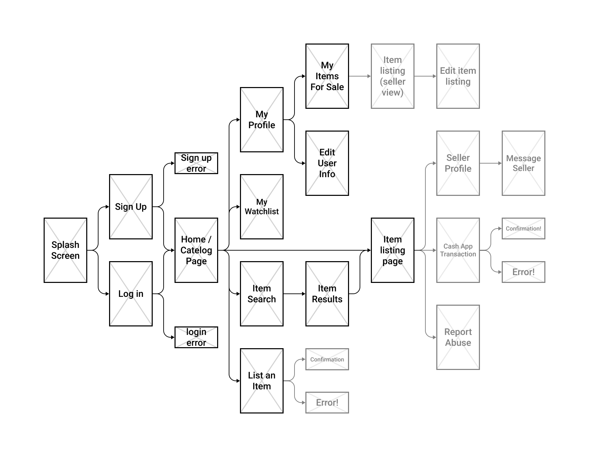

 

# [Frank's List](http://softdes-final.herokuapp.com/)
### A simple web app for buying and selling items within the [BOW](https://www.bow3colleges.org/) community, created by [Jasper Katzban](https://github.com/jasperkatzban/), [Kelly Yen](https://github.com/jellyyams/), and [Jonas Kazlauskas](https://github.com/jonaskaz) at [Olin College](http://www.olin.edu/).

## What is it?
Our goal is to build an online store for college students to sell and buy second-hand goods from each other at an affordable price. It would function similarly to [Craigslist](https://www.craigslist.org/), but without the risk of interacting with complete strangers, and would be designed to cater towards college student’s needs. Ideally, a website like this will help reduce the waste and make it easier for students to exchange items.

## How do I use it?
Simply head over to [this link](http://softdes-final.herokuapp.com/) to get started! Read on for more details, or feel free to poke around yourself!

#### Getting Started
Before being able to use the website, users need to sign up for an account, which requires them to provide their full name, home institution, graduation year, and email. If the user tries to sign up with an email that isn’t on an approved list, the user will be unable to sign up (this feature is built in to prevent people who don’t go to the college from using the website). 

#### Browsing Items
Once the user has signed up and logged in with valid credentials, they can start browsing through the available items using the categories bar to help filter results. They can browse using the card view or with the more compact table view depending on their preference.

#### The Wishlist
If a user finds an item they are interested in purchasing eventually, they can save that item to their wishlist by clicking on the &#10084; button in the user home page, or undo this by clicking the &#9989; icon. To view their wishlist, users can click on the drop down menu in the top navbar, and select “wishlist”. To remove items from their wishlist, users can click on the &#10060; button next to each item. 

#### Contacting the Seller
If a user is interested in a specific item, they can click on a listing to view additional information about the item. Here, they can click the "contact seller" button to send an email to the item seller regarding the purchase of said item.

#### Listing Items
Users can also list their own items by clicking on the “list item” button in the nav bar. When listing an item, users provide the item's name, description, price, quality, and some images. 

#### Purchase and Sale History
Users can view items they've purchased in the past and can also manage the items they're currently selling in the “selling” tab in the top navbar. Users have the option to unlist items and edit listings. 

#### Editing a Profile
Users can edit their user profile and submit a profile picture. 

## How does it work?
Our website utilizes a variety of tools and libraries. We use a firebase firestore database to store all of the user and item information. Our website uses flask to host and serve webpages, and the bootstrap library to help style and organize each webpage. 

## Impact
For our project, we wanted to create something that could be legitimately used by members of our college community and beyond. Though our work is not deeply rooted in any ethical agendas or goals, we did see this as an opportunity to add value to the world while learning some new software development skills along the way.

At Olin, we have a strong focus on preparing students for the world of entrepreneurship and learning how to solve real problems in uncharted waters. One of our foundation courses, Products & Markets, does just this - and previous work by a team member in that course was the inspiration for the core functionality of this project.

At Olin, we have a system called ‘CarpeDiem’ or ‘carpe’ for short - it’s a mailing list that serves as a bulletin for members of our community to share thoughts, events, resources, and to sell items. We saw that, although this system works well as a whole, it lacked specific features necessary to buying and selling items. In other words, Craigslist via email is a big no. 

With this in mind, we decided to create a web app that allowed for the easy buying and selling items within the college community. <add more from P&M>

## Project Evolution
We began wireframing our website MVP:

Next, we created a set of simple HTML templates that displayed some text and were routed using flask. From there, we started learning how to pass data into and out of the pages using the flask and HTML forms, and defined some of our classes like item and user. <insert early stage picture>.

After our first architectural review, we decided to use firebase to store data. We quickly learned how to work with this package, and started building out more simple html pages and displaying data.

This work continued fairly linearly, and we eventually decided we wanted it to look pretty. This is when we implemented bootstrap to quickly add formatting and beautify the website. <insert ugle image then pretty image XD> This work continued while we built out the rest of our pages. <idk show some cool features or something in a pic>. 

Some stretch goals include integrating with a cashapp service, offering a more polished user experience, and implementing more features such as keyword search, social media integration, and mobile site optimization.

- initial motives
- planning phase
- initial implementation
- resources we used over time
- feature map?
- current features vs stretch goals

## Attribution
We used the following libraries and packages to build the core functionality of our app:
- [Python 3.7](https://www.python.org/)
- [Flask 1.1.1](https://flask.palletsprojects.com)
- [Firebase](https://firebase.google.com/)
- [Bootstrap 4](https://getbootstrap.com/)

This is a final project for [Software Design](https://sd2020spring.github.io/), a course at [Olin College of Engineering](http://www.olin.edu/). We'd like to thank our professors [Steve Matsumoto](https://www.stevematsumoto.net/) and [Amon Millner](http://www.amonmillner.com/), as well as the amazing [NINJAs](http://www.olin.edu/academic-life/student-affairs-and-resources/resources-and-support/academic-support/) and our peers. We also got help from [Shreya](https://github.com/18chowdhary), whos [earlier Softdes Project](https://github.com/sd19spring/Candidates-Weekend-Guide?fbclid=IwAR0dN-WHkMn6B7c0D_eveA1F_WIilv2xzkOCyg07WIehIpwuyqk_r8xuwhY) served as scaffolding for the backend architecture we developed for this project.
